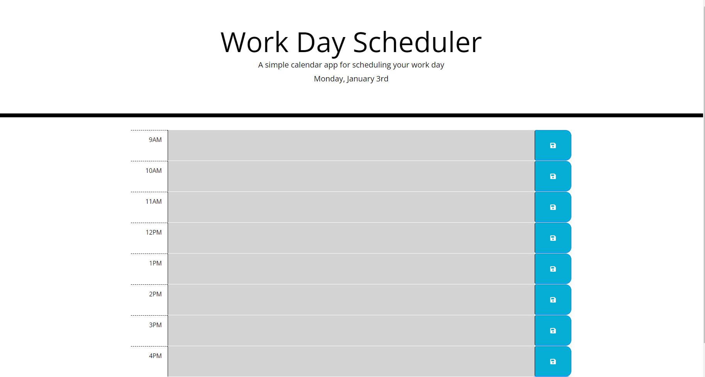

# the-only-work-day-scheduler-you-need

## Description

This is a simple work day scheduler that gives you an easy way to organize a 9-5 work day. The structure is simple, with there only being eight rows for each hour from 9AM to 5PM. Each row has the time, a sizeable area to type in a description, and a save button. Bootstrap, along with minimal unique CSS, were used when creating the page.

Moment.js was used to fetch the current date to display at the top of the page and in the logic used to determine what color the time slots should be, based upon the current hour. If the time for the time slot has passed, it will become gray and be rendered uneditable. If it is the current hour, it becomes red, while future hours are green. Both red and green hours can be edited and subsequently saved into local storage using the blue save button to the right.

There is a timeout in place that takes the time you load onto the page and launches an audit at the start of the nearest hour. After that, an audit is done at the start of every hour while the page remains open to adjust the color of the time slots accordingly.

Additionally, Moment.js is used to save the date in the localStorage, allowing the entire page to be reset when a new day begins, clearing all events in the time slots.

It is deployed at: https://spencerhulse.github.io/the-only-work-day-scheduler-you-need/
